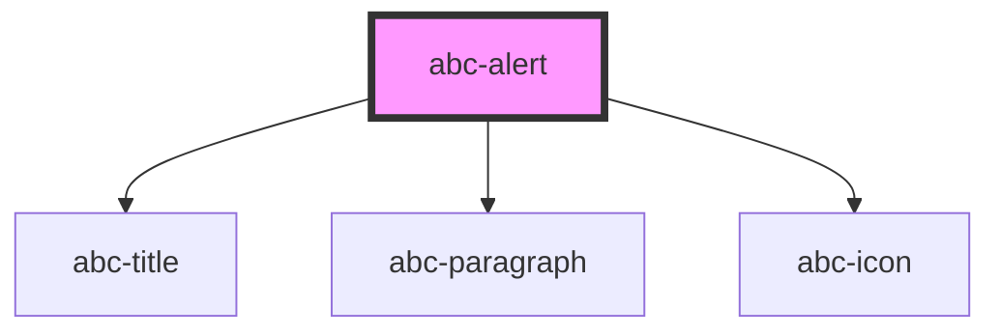

# abc-alert

<!-- Auto Generated Below -->

## Properties

| Property  | Attribute | Description | Type      | Default     |
| --------- | --------- | ----------- | --------- | ----------- |
| `content` | `content` |             | `string`  | `undefined` |
| `opened`  | `opened`  |             | `boolean` | `undefined` |
| `title`   | `title`   |             | `string`  | `undefined` |
| `type`    | `type`    |             | `string`  | `undefined` |

## Methods

### `open() => Promise<void>`

#### Returns

Type: `Promise<void>`

## Dependencies

### Depends on

- [abc-title](../abc-title)
- [abc-paragraph](../abc-paragraph)
- [abc-icon](../abc-icon)

### Graph

----------------------------------------------

*Built with [StencilJS](https://stenciljs.com/)*
